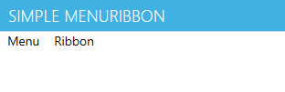
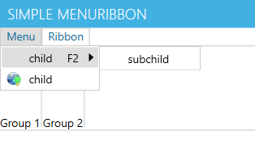
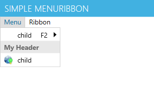
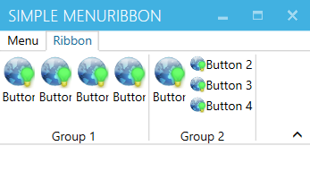
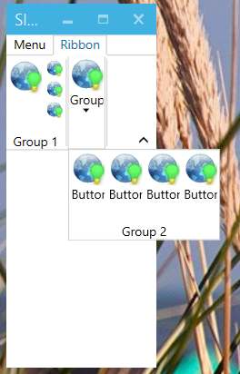

## MenuRibbon.WPF
A WPF control library providing a single control that can act as a Menu bar, a Ribbon bar, or even both at the same time.
In fact it is the only control library available mixing both Ribbon and Menu together, as it is against Microsoft UX guidelines so far.

- Source on GitHub: http://github.com/superlloyd/MenuRibbon
- Install From NuGet: `Install-Package MenuRibbon.WPF`

All the `MenuRibbon.WPF` classes can be referenced in XAML by the following namespace declaration:
`http://schemas.menuribbon.net/xaml`


### Gotchas
Menu and Ribbon have incompatible focus handling / behavior. Hence if one click on the MenuItem that focuses the MenuRibbon bar, not so if one click on a RibbonItem.
Also ItemsButton don't capture focus on click (unless they have a popup) so that they can be used anywhere without stealing focus from main content.


### Dependencies
- [MahApps.Metro](http://mahapps.com) 
- [Rx-Linq](https://www.nuget.org/packages/Rx-Linq) 

This control has been tested and developed to provide the distraction free look of Word 2013. **MahApps.Metro** provided this look for WPF applications.

**Rx-Linq** is used to handle mouse events internally. The class `WPFx` has multiple extension methods returning `Observable` for various mouse events, such `MouseDown`, `MouseClick`, `MouseDrag`, etc...


### Main Classes
- **MenuRibbon** Top level container for either `RibbonItem` or `MenuItem`.
- **RibbonItem** An `HeaderedContentControl` subclass which Content can be any Control, but preferably a `RibbonBar`.
  - **RibbonBar** An `ItemsControl` for `RibbonGroup`, and the main `Content` for `RibbonItem`.
  - **RibbonGroup** An `HeaderedItemsControl` for any control, preferable `ItemsButton` though.
- **MenuItem** An `HeaderedItemsControl` that show its children in a popup. 
- **ItemsButton** Another top level container for `MenuItem`, can be used anywhere.


#### Menu Classes
`BasePopupItem` (the base class of both `ItemsButton` and `MenuItem`) is an `HeaderedItemsControl` which can have any Control for its Item. Use `MenuItem` to give it a Menu appearance. 
Its properties are:
- `IsCheckable`, `IsChecked`, `Icon`
- ICommandSource: `Command`, `CommandParameter`, `CommandTarget`
- `ClickEvent`, `Click` handler, `override OnClick()`
- `IsPressed`, `IsHovering`, `IsHighlighted`

`MenuItem` is a `BasePopupItem` that should be part of an Item hierarchy under an `IPopupRoot` such as `ItemsButton` or `MenuRibbon`, otherwise they won't show their popup. 
Its properties are:
- `InputGestureText`

`ItemsButton` can be used anywhere a `Button` is.
Its properties are:
- `ControlSizeDefinition`, `LargeIcon`, `SmallIcon`
- `IsSplitButton`, if true the button can both have an action and children Items.
- `IsHoveringSplitter`


#### Ribbon Classes
`RibbonItem` is a `HeaderedContentControl` and must be an Item of a `MenuRibbon`, it can have any content, preferably a `RibbonBar`. 
Its properties are:
- `IsPinned`
- `IsOpen`
- `IsPressed`, `IsHovering`, `IsHighlighted`

`RibbonBar` is an `ItemsControl` which items must be `RibbonGroup`. 
Its properties are:
- `GroupSizeReductionOrder` which specify the order in which to reduce `RibbonGroup` when resizing.

`RibbonGroup` is an `HeaderedItemsControl` which could have any Item, but to implement [MS-Ribbon Layout and Resizing](http://msdn.microsoft.com/en-us/library/ff701790(v=vs.110).aspx) Items must implement `IRibbonGroupControl` such as `ItemsButton`.
Its properties are:
- `GroupSizeDefinitions`


#### KeyTipService
`KeyTipService` handle KeyTip which enable keyboard access to any UI element. Particularly useful as `ItemsButton` don't capture focus.
It has the following *attached* properties:
- `KeyTip`
- `IsKeyTipScope`
- `KeyTipStyle`


#### Bonus Classes
- `UIHelper`: static extension class with lost of extension method for UIElement or DependencyObject.
- `CommandTool`: static extension method to properly call either RoutedCommand or normal ICommand. 
- `WeakDictionary`, `WeakHastable`: `IDictionary` with weak keys (i.e. `WeakReference`).
- `WeakSet`, `WeakList`: `ICollection`s with weak items.
- `ImageExtension`: markup extension to convert Uri to an `Image`.
- `BoolToValueConverter`: `IValueConverter` from boolean to given values.


### Examples
Let's show some small but common use case to get the code started with `MenuRibbon.WPF`.


#### Setup a simple MenuRibbon
Below is the source code for a very minimalistic ribbon. Note that the window is of type `MetroWindow`.

```XML
<metro:MetroWindow 
	x:Class="TestApp.Window1"
	xmlns="http://schemas.microsoft.com/winfx/2006/xaml/presentation"
	xmlns:x="http://schemas.microsoft.com/winfx/2006/xaml"
	xmlns:metro="http://metro.mahapps.com/winfx/xaml/controls"
	xmlns:mr="http://schemas.menuribbon.net/xaml"
	Title="Simple MenuRibbon" Height="350" Width="400">
	<Grid>
		<Grid.RowDefinitions>
			<RowDefinition Height="Auto"/>
			<RowDefinition Height="*"/>
		</Grid.RowDefinitions>
		<mr:MenuRibbon>
			<mr:MenuItem Header="Menu">
				<mr:MenuItem Header="child" InputGestureText="F2" >
					<mr:MenuItem Header="subchild"/>
				</mr:MenuItem>
				<mr:MenuItem Header="child">
					<mr:MenuItem.Icon>
						<Image Width="16" Source="connected_48.png"/>
					</mr:MenuItem.Icon>
				</mr:MenuItem>
			</mr:MenuItem>
			<mr:RibbonItem Header="Ribbon">
				<mr:RibbonBar>
					<mr:RibbonGroup Header="Group 1">
					</mr:RibbonGroup>
					<mr:RibbonGroup Header="Group 2">
					</mr:RibbonGroup>
				</mr:RibbonBar>
			</mr:RibbonItem>
		</mr:MenuRibbon>
	</Grid>
</metro:MetroWindow>
```
This will produce that window:



If the Ribbon is expanded and the menu open you will get that:




#### Using custom control inside a Menu
Those `MenuItem` can display any content as is (unlike SDK `MenuItem`), so let's add a Word like header in the menu!
First let's define an header style:
```XML
<Style x:Key="HeaderStyle"  TargetType="TextBlock">
	<Setter Property="Background" Value="#E8E8E8"/>
	<Setter Property="Padding" Value="6,3"/>
	<Setter Property="FontWeight" Value="Bold"/>
	<Setter Property="Foreground" Value="#6D6D6D"/>
</Style>
```
Then add a `TextBlock` with that style to the menu
```XML
<mr:MenuItem Header="Menu">
	<mr:MenuItem Header="child" InputGestureText="F2" ><!-- children --></mr:MenuItem>
	<TextBlock Style="{StaticResource HeaderStyle}">My Header</TextBlock>
	<mr:MenuItem Header="child"><!-- children --></mr:MenuItem>
</mr:MenuItem>
```
And voila, a nice header!




#### Using data binding with a MenuItem
As it is a somewhat non standart `ItemsControl` (it has multiple container item type) the `ItemTemplate` property doesn't use `HierarchicalItemsTemplate`, instead just use a normal `DataTemplate` of a `MenuItem`.
Here is how one MenuItem with databing is set in the sample:
```XML
<mr:MenuItem Header="DataContextList" ItemsSource="{Binding RandomList, ElementName=root}">
	<mr:MenuItem.ItemTemplate>
		<DataTemplate>
			<mr:MenuItem Header="{Binding Header}"
							InputGestureText="{Binding Shortcut}"
							ItemsSource="{Binding Children}">
			</mr:MenuItem>
		</DataTemplate>
	</mr:MenuItem.ItemTemplate>
</mr:MenuItem>
```

#### Resizing Ribbon Bar
A `RibbonItem` could have any kind of content. However if the content is a `RibbonBar` which contains multiple `RibbonGroup` which contains mulitple `ItemsButton` it will resize like the Microsoft Ribbon.

[MS-Ribbon Layout and Resizing](http://msdn.microsoft.com/en-us/library/ff701790(v=vs.110).aspx)

- A `RibbonBar` could have a `GroupSizeReductionOrder` which specifies the name of the `RibbonGroup` in the order they must be reduced.
- A `RibbonGroup` has a `GroupSizeDefinitions` property which hold a collection of `RibbonGroupSizeDefinition`, one for each (progressively smaller) size.
- A `RibbonGroupSizeDefinition` either contains a list of `RibbonControlSizeDefinition` (one for each of its `RibbonGroup`'s control at this size level), or the property `IsCollapsed` is true.
- A `RibbonControlSizeDefinition` has various properties that alter the look and size of a single `ItemsButton`. It can be set explicitely or by the `RibbonGroup` when resized.

Here is a simple `RibbonBar` setup.
```XML
<mr:RibbonItem Header="Ribbon">
	<mr:RibbonBar GroupSizeReductionOrder="gr2,gr1">
		<mr:RibbonGroup x:Name="gr1" Header="Group 1">
			<mr:RibbonGroup.GroupSizeDefinitions>
				<!-- largest size all button big -->
				<mr:RibbonGroupSizeDefinition>
					<mr:RibbonControlSizeDefinition IconSize="Large" IsHeaderVisible="True"/>
					<mr:RibbonControlSizeDefinition IconSize="Large" IsHeaderVisible="True"/>
					<mr:RibbonControlSizeDefinition IconSize="Large" IsHeaderVisible="True"/>
					<mr:RibbonControlSizeDefinition IconSize="Large" IsHeaderVisible="True"/>
				</mr:RibbonGroupSizeDefinition>
				<!-- 3 right most buttons are collapsed into small buttons -->
				<mr:RibbonGroupSizeDefinition>
					<mr:RibbonControlSizeDefinition IconSize="Large" IsHeaderVisible="True"/>
					<mr:RibbonControlSizeDefinition IconSize="Small" IsHeaderVisible="True"/>
					<mr:RibbonControlSizeDefinition IconSize="Small" IsHeaderVisible="True"/>
					<mr:RibbonControlSizeDefinition IconSize="Small" IsHeaderVisible="True"/>
				</mr:RibbonGroupSizeDefinition>
				<!-- remove text on small buttons -->
				<mr:RibbonGroupSizeDefinition>
					<mr:RibbonControlSizeDefinition IconSize="Large" IsHeaderVisible="True"/>
					<mr:RibbonControlSizeDefinition IconSize="Small" IsHeaderVisible="False"/>
					<mr:RibbonControlSizeDefinition IconSize="Small" IsHeaderVisible="False"/>
					<mr:RibbonControlSizeDefinition IconSize="Small" IsHeaderVisible="False"/>
				</mr:RibbonGroupSizeDefinition>
				<!-- collapse the all group to 1 popup -->
				<mr:RibbonGroupSizeDefinition IsCollapsed="True"/>
			</mr:RibbonGroup.GroupSizeDefinitions>
			<mr:ItemsButton Header="Button 1" 
								LargeIcon="{mr:Image connected_48.png, Width=32, Height=32}"
								SmallIcon="{mr:Image connected_48.png}"
								/>
				<!-- 3 more similar buttons -->
		</mr:RibbonGroup>
		<mr:RibbonGroup x:Name="gr2" Header="Group 2">
			<!-- same setup as Group 1 -->
		</mr:RibbonGroup>
	</mr:RibbonBar>
</mr:RibbonItem>
```
And voila, this is a properly resizing ribbon:



All the way down to collapsed group:




### TODO
- AutomationPeer.
- Galleries.
- ComboBoxes.
- Animations / VisualStates.

### Contributions

If you've improved MenuRibbon.WPF and think that other people would enjoy it, submit a pull request at:
http://github.com/superlloyd/MenuRibbon
